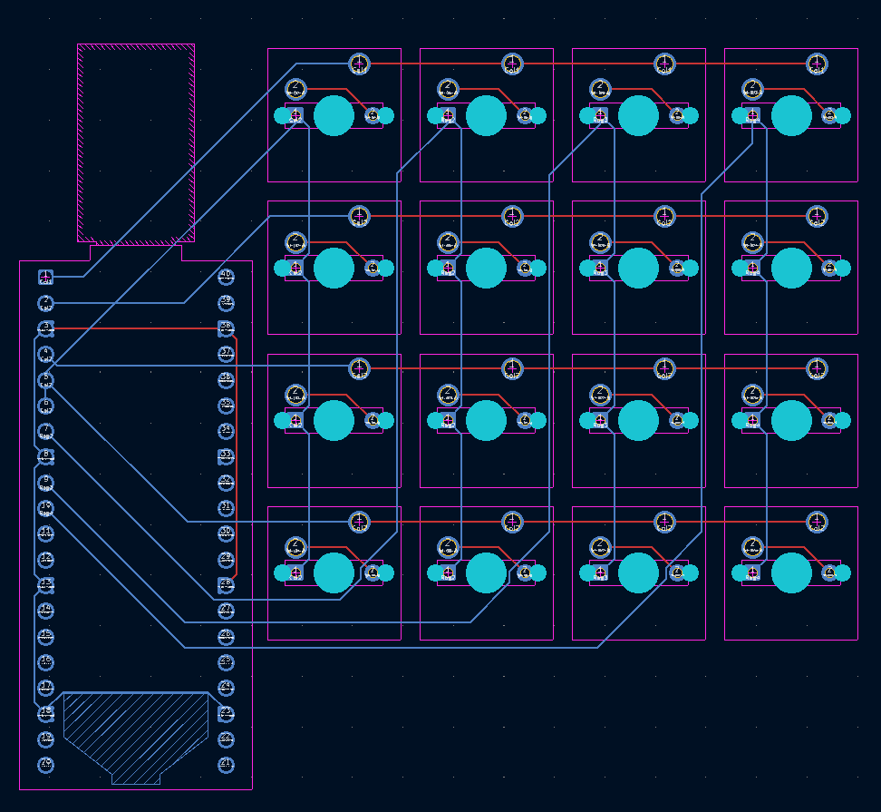
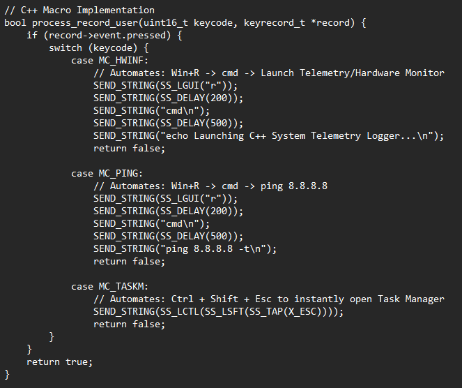

# ⌨️ Custom 16-Key Mechanical Macropad

A custom-built, programmable 16-key mechanical macropad powered by an RP2040 microcontroller. Designed to streamline custom PC building operations by automating hardware-level system-testing workflows, replacing repetitive manual data entry with a dedicated hardware interface.

  

## ✨ Features

* **Anti-Ghosting Matrix:** Features a custom 4x4 switch matrix with a 1N4148 diode array to completely eliminate key ghosting.
* **Isolated 2-Layer Routing:** Routed using 2-layer traces in KiCad, deliberately isolating horizontal rows on the bottom copper layer (blue) and vertical columns on the top copper layer (red) for optimal signal integrity.
* **Hardware Automation:** Programmed with 3 dedicated macro layers in C++ utilizing QMK's `process_record_user` state machine.
* **Workflow Integration:** Automates redundant PC system-testing workflows (launching hardware telemetry/sensors, automated network ping tests, and instant task manager overrides).

## 🗂️ Project Structure & Configuration

### Repository Layout
* **/macropad** — Contains the KiCad hardware schematic, PCB layout (`.kicad_pcb`), and footprint files.
* **/firmware** — Contains the C++ QMK environment, hardware configurations (`info.json`), and the macro logic (`keymap.c`).

### C++ Macro Implementation

  

---

> ### 📋 Technical Notes on QMK Implementation
> The macropad utilizes a `COL2ROW` diode direction configuration mapped directly to the RP2040's GPIO pins. The macro implementation leverages QMK's `SEND_STRING` functionality combined with `SS_DELAY` to account for OS-level execution latency when automating command-prompt-based benchmarking tools. 
> 
> The hardware matrix prevents electrical shorts by keeping column/row polling strictly on independent planes (Front Copper and Back Copper).